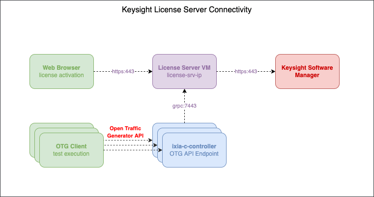

# Keysight Elastic Network Generator Licensing and Image Access

## License Server

In order to use capabilities of Elastic Network Generator that require a valid license, you need to deploy a Keysight License Server. The License Server is a virtual machine and it is distributed as OVA and QCOW2 images (you only need one of them depending on your hypervisor).

* [OVA image](https://storage.googleapis.com/kt-nas-images-cloud-ist/slum-1.7.0-204.ova)
* [QCOW2 image](https://storage.googleapis.com/kt-nas-images-cloud-ist/slum-1.7.0-204.qcow2.gz), compressed with `gzip`

To make a decision where to deploy the License Server VM, take into the account the following requirements:

* VMWare ESXi hypervisor, 6.5 or newer versions are supported using the OVA image
* For Linux-based QEMU or KVM, use the QCOW2 image (uncompressed)
* 2 vCPU cores
* 4GB of RAM
* Minimum of 100GB storage
* 1 vNIC for network connectivity. Note that DHCP is the preferred option, and this is also how the VM is configured to obtain its IP address.

Network connectivity requirements for the License Server VM

1. Internet access from the VM over HTTPS is desirable for online license activation, but not strictly required. Offline activation method is available as well.
2. Access from a user browser over HTTPS (TCP/443) for license operations (activation, deactivation, reservation, sync)
3. Access from any `ixia-c-controller` that needs a license during a test run over gRPC (TCP/7443) for license checkout and check-in

Here is an example of how different components communicate with the License Server:



## License Activation

You will now be able to activate licenses and use the License Server on your Elastic Network Generator setup. Go to https://<obtainedIpAddress> to access the application. Enter credentials: admin/admin

If you have an activation code, to perform an online activation, click "Activate Licenses", enter the code and click "Activate". For offline mode, choose "Offline Operations" instead.

## Access to private images on Github Container Registry

In order to use this method, you need a Github account. The account should be given access to private [KENG](https://www.keysight.com/us/en/products/network-test/protocol-load-test/keysight-elastic-network-generator.html) images by Keysight team. Use "Request Demo" link on [KENG](https://www.keysight.com/us/en/products/network-test/protocol-load-test/keysight-elastic-network-generator.html) page for that.

Create a new personal access token (PAT) via [https://github.com/settings/tokens/new](https://github.com/settings/tokens/new?scopes=read:packages):

* Note: ghcr.io
* Expiration: 90 days
* Scope: read:packages (should be already selected if the link above was used)

Save the token in a password manager and use it for `CR_PAT` variable below. Also, don't forget to provide your github username for `CR_USERNAME`

```Shell
CR_PAT=YOUR_TOKEN
CR_USERNAME=YOUR_USERNAME
echo $CR_PAT | docker login ghcr.io -u $CR_USERNAME --password-stdin
```

Pull KENG images to validate access (note, depending on the access provided, you might need to use a different set of images):

```Shell
docker pull ghcr.io/open-traffic-generator/licensed/ixia-c-controller:0.0.1-3002
docker pull ghcr.io/open-traffic-generator/licensed/ixia-c-protocol-engine:1.00.0.205
```
