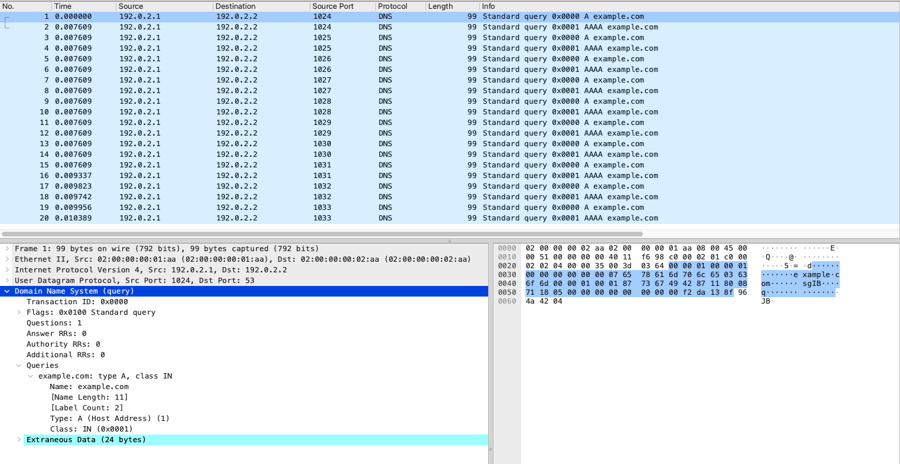

# Dear snappi, please meet Scapy!

## Overview

As [Scapy Project](https://scapy.net/) puts it:

> Scapy is a powerful interactive packet manipulation program. It is able to forge or decode packets of a wide number of protocols, send them on the wire, capture them, match requests and replies, and much more.

In other words, Scapy allows you to craft any packet you want, including L2-4 headers as well as L7 payload. It can also send these packets into a network, as is.

Meanwhile, the [Open Traffic Generator API](https://otg.dev) with its Python client library [snappi](https://snappi.dev), is really great with scaling up the task of putting the packets onto a wire by leveraging OTG-compliant traffic generators, like [Ixia-c](https://ixia-c.dev). The OTG supports the notion of flows, with precise capabilities to schedule packet transmission – like rate, interval and duration. It also has rich capabilities to iterate over ranges of MAC and IP addresses, TCP/UDP ports and other parameters.

Wouldn't it be nice if these two could meet and work as a team?

## How would it work?

Let's assume you want to stress-test a network device with a large number of specific packets. For example, DNS requests & replies. With Scapy, it is easy to craft such payload:

```Python
from scapy.all import *

# create custom DNS request payloads with Scapy
requests = [DNS(id=0, rd=1, qr=0, qd=DNSQR(qtype="A",    qname="example.com")),
            DNS(id=1, rd=1, qr=0, qd=DNSQR(qtype="AAAA", qname="example.com"))]
```

Now, with snappi, we can use these payloads to create a dedicated flow for each Scapy packet, with duration and rate we need.

```Python
import snappi

api = snappi.api(location=OTG_API, verify=False)
cfg = api.config()
packet_count = 10 # send 10 packets per each flow

# flows for requests
for i in range(len(requests)): 
    n = "request" + str(i)
    f = cfg.flows.flow(name=n)[-1]
    # will use UDP with custom payload
    eth, ip, udp, payload = f.packet.ethernet().ipv4().udp().custom()
    eth.src.value, eth.dst.value = "02:00:00:00:01:AA", "02:00:00:00:02:AA"
    ip.src.value, ip.dst.value = "192.0.2.1", "192.0.2.2"
    # increment UDP source port number for each packet
    udp.src_port.increment.start = 1024
    udp.src_port.increment.step = 1
    udp.src_port.increment.count = requests_count
    udp.dst_port.value = 53
    # copy a payload from Scapy packet into a snappi flow
    payload.bytes = requests[i].build().hex() 
    # number of packets to transmit
    f.duration.fixed_packets.packets = requests_count
    # delay between flows to simulate a sequence of packets: 1ms
    f.duration.fixed_packets.delay.microseconds = 1000 * i
```

 Some details above are omitted, see [scapy2otg.py](scapy2otg.py) for more.

 As a result, the produced OTG configuration of the first flow of the DNS requests will have a custom payload after the UDP layer (see the very end of the YAML below):

 ```Yaml
flows:
- duration:
    choice: fixed_packets
    fixed_packets:
      delay:
        choice: microseconds
        microseconds: 0
      gap: 12
      packets: 10
  metrics:
    enable: true
name: request0
  packet:
  - choice: ethernet
    ethernet:
      dst:
        choice: value
        value: 02:00:00:00:02:AA
      src:
        choice: value
        value: 02:00:00:00:01:AA
  - choice: ipv4
    ipv4:
      dst:
        choice: value
        value: 192.0.2.2
      src:
        choice: value
        value: 192.0.2.1
  - choice: udp
    udp:
      dst_port:
        choice: value
        value: 53
      src_port:
        choice: increment
        increment:
          count: 10
          start: 1024
          step: 1
  - choice: custom
    custom:
      bytes: 000001000001000000000000076578616d706c6503636f6d0000010001
```

## Captured & Framed

When captured, the packet frames generated by Ixia-c look as DNS queries in Wireshark, with the exception of additional data signature Ixia-c adds at the end of each packet. The signature is needed to identify each packet at the receiving side, and measure latency, packet loss and other metrics. If you look into [scapy2otg.py](scapy2otg.py), the following line instructs Ixia-c to add the signature: `f.metrics.enable = True`.



An alternative implementation that uses port-level metrics instead of packet signatures can be found in [scapy2otg-port.py](scapy2otg-port.py)

## Giving it a try

### Prerequisites

* Linux host or VM with sudo permissions and Docker support. See [some ready-to-use options](README.md#options-for-linux-vm-deployment-for-containerlab)
* `git` - how to install depends on your Linux distro.
* [Docker](https://docs.docker.com/engine/install/)
* [Containerlab](https://containerlab.dev/install/)
* Clone of the repository

    ```Shell
    git clone --recurse-submodules https://github.com/open-traffic-generator/otg-examples.git
    cd otg-examples/clab/ixia-c-b2b
    ```
### TLDR version

```Shell
make install build deploy run-scapy clean
```

Open `p1.pcap` and `p2.pcap` to inspect captured packets.

Otherwise, follow a step-by-step guide:

### Prepare a `snappi` container image

Run the following only once, to build a container image where `snappi` program will execute:

```Shell
sudo docker build -t snappi:local .
```

### Deploy a lab

```Shell
sudo -E containerlab deploy -t topo.yml
```

### Run scapy2otg test

```Shell
sudo docker exec -it clab-ixcb2b-snappi bash -c "python scapy2otg.py"
```

### Destroy the lab

```Shell
sudo -E containerlab destroy -t topo.yml
```

