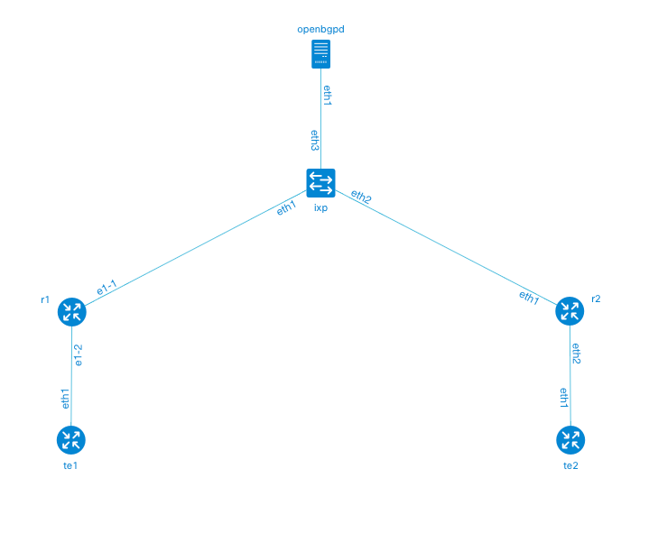

# Guest lab: IXP with OpenBGPd Route Server

## Overview

## Lab configuration

### Layer 3 topology and generated traffic flows



## Prerequisites

* Licensed [Keysight Elastic Network Generator](https://www.keysight.com/us/en/products/network-test/protocol-load-test/keysight-elastic-network-generator.html) images. Read more in [KENG.md](/KENG.md)
* Linux host or VM with sudo permissions and Docker support
* [Docker](https://docs.docker.com/engine/install/)
* Arista cEOSLab image. Arista EOS containerized version is called cEOSLab and can be obtained by registering on Arista website and downloading an archive with container image. Follow the [instructions](https://containerlab.dev/manual/kinds/ceos/#getting-ceos-image) provided on Containerlab website to get it. Once the image is installed, tag it as `ceos:latest`:

    ```Shell
    docker tag <ceos_image_name:version> ceos:latest
    ```

* Clone of this repository

    ```Shell
    git clone https://github.com/open-traffic-generator/otg-examples.git
    ```

## Quick start

To run all the steps at once, execute:

```Shell
cd otg-examples/clab/ixp-openbgpd
make all
make clean
```

Otherwise, follow step-by-step instructions below:

## Install components

1. Install the latest release of Containerlab. For more installation options see [here](https://containerlab.dev/install/).

    ```Shell
    bash -c "$(curl -sL https://get.containerlab.dev)"
    ```

2. Install `otgen` tool, version `0.4.0-rc1` or later.

    ```Shell
    curl -L "https://github.com/open-traffic-generator/otgen/releases/download/v0.4.0-rc1/otgen_0.4.0-rc1_$(uname -s)_$(uname -m).tar.gz" | tar xzv otgen
    sudo mv otgen /usr/local/bin/otgen
    sudo chmod +x /usr/local/bin/otgen
    ```

3. Make sure `/usr/local/bin` is in your `$PATH` variable (by default this is not the case on CentOS 7)

    ```Shell
    cmd=otgen
    dir=/usr/local/bin
    if ! command -v ${cmd} &> /dev/null && [ -x ${dir}/${cmd} ]; then
      echo "${cmd} exists in ${dir} but not in the PATH, updating PATH to:"
      PATH="/usr/local/bin:${PATH}"
      echo $PATH
    fi
    ```

## Deploy the lab

1. Create a bridge `ixp` to represent an IXP LAN segment

    ```Shell
    sudo bash -c 'ip link add name ixp type bridge && ip link set dev ixp up'
    ```

2. Launch the deployment using Containerlab

    ```Shell
    cd otg-examples/clab/ixp-openbgpd
    sudo -E containerlab deploy
    ```

## Run tests

1. Traffic between subnets directly connected to `r1` and `r2`

    ```Shell
    otgen --log debug run -k --file otg.json -m flow | otgen transform -m flow | otgen display -m table
    ```

2. Traffic from behind emulated CE routers downstream from `r1` and `r2`. These emulated routers are created by OTG Test Ports as `ce1111` and `ce2222`:

    ```Shell
    export OTG_LOCATION_P1="localhost:5555+localhost:50071"
    export OTG_LOCATION_P2="localhost:5556+localhost:50072"

    otgen create device -n ce1111 --ip 192.0.2.2 --gw 192.0.2.1 --prefix 30 -p p1 | \
    otgen add bgp -d ce1111 --asn 1111 --peer 192.0.2.1 --route 1.1.1.1/32 | \
    otgen add device -n ce2222 --ip 203.0.113.2 --gw 203.0.113.1 --prefix 30  -p p2 | \
    otgen add bgp -d ce2222 --asn 2222 --peer 203.0.113.1 --route 2.2.2.2/32 | \
    otgen add flow -n f1 --tx ce1111 --rx ce2222 --dmac auto --src 1.1.1.1 --dst 2.2.2.2 --rate 100 --count 1000 --size 512 | \
    otgen add flow -n f2 --tx ce2222 --rx ce1111 --dmac auto --dst 1.1.1.1 --src 2.2.2.2 --rate 100 --count 1000 --size 512 | \
    otgen --log debug run --insecure --metrics flow | otgen transform --metrics flow | otgen display -m table
    ```

## Destroy the lab

```Shell
sudo containerlab destroy -c
sudo ip link delete dev ixp
```

## Credits

* Original [`Basic IXP Lab with OpenBGPd Route Server`](https://github.com/hellt/openbgpd-lab) lab copyright of [Roman Dodin](https://github.com/hellt)
