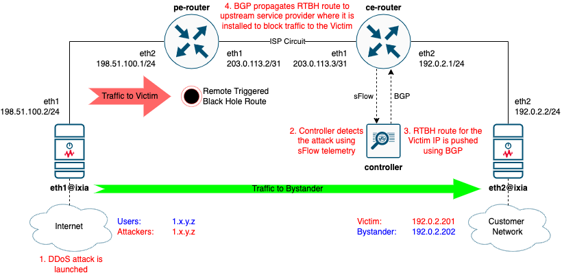

# Remote Triggered Black Hole Scenario

## Overview

Remote Triggered Black Hole (RTBH) is a common DDoS mitigation technique. It uses BGP anouncements to request an ISP to drop all traffic to an IP address under a DDoS attack.

Read a [blog post](https://blogs.keysight.com/blogs/tech/traf-gen.entry.html/2022/05/27/netops_ci_validatingbgp-basedddosprotectionwi-PA43.html) dedicated to this scenario.



## Prerequisites

* Linux host or VM with sudo permissions and Docker support. See [some ready-to-use options below](#options-for-linux-vm-deployment-for-containerlab)
* `git` - how to install depends on your Linux distro.
* [Docker](https://docs.docker.com/engine/install/)
* [Containerlab](https://containerlab.dev/install/)
* Access to the Linux host from your computer over TCP ports 22 (SSH), 8008 (DDoS Protect Dashboard) and 8080 (Graphite topology visualization)

## Clone the repository

1. Clone this repository to the Linux host where you want to run the lab. Do this only once.

```Shell
git clone --single-branch https://github.com/open-traffic-generator/otg-examples.git
```

2. Navigate to the lab folder

```Shell
cd otg-examples/clab/rtbh
```

## Prepare a `gosnappi` container image

Run the following only once, to build a container image where `go test` command would execute. This step will pre-load all the Go modules needed by the test into the local `gosnappi` image. 

```Shell
sudo docker build -t gosnappi:local .
```

## Deploy the topology with Containerlab

```Shell
sudo -E containerlab deploy -t topo.yml
```

## Open DDoS Protect Dashboard

As the lab is being deployed, in Containerlab output you should see a line like this:

  > DDoS Protect Dashboard 🛡️  http://some-ip-address:8008/app/ddos-protect/html/index.html

Open the link in the browser to see the DDoS Protect Dashboard

## Run OTG Test

Execute the test by running `go test` in `clab-rtbh-gosnappi` container. Note, it will take some time for Golang to compile the test binary, so expect a delay before the test starts running.

```Shell
DMAC=`sudo docker exec clab-rtbh-pe-router vtysh -c  'sh interface eth2 | include HWaddr' | awk "{print \\$2}"`
sudo docker exec -it clab-rtbh-gosnappi bash -c "go test -dstMac=${DMAC}"
```

## Destroy the lab

```Shell
sudo -E containerlab destroy -t topo.yml
```

## Options for Linux VM deployment for Containerlab

### Containerlab VM deployment on Mac using Multipass

1. If you're on Mac, an example below can be used to create an Ubuntu 20.04LTS VM `otg-demo`, using [Multipass](https://multipass.run/). Ubuntu 22.04 is not yet supported for this test.

```Shell
multipass launch 20.04 -n otg-demo -c4 -m8G -d32G
multipass shell otg-demo
sudo apt update && sudo apt install docker.io -y
bash -c "$(curl -sL https://get.containerlab.dev)"
```

2. Delete the VM after testing is done

```Shell
multipass stop otg-demo
multipass delete otg-demo
```

###  Containerlab VM deployment in Google Cloud

1. Create a VM in a default VPC, with needed firewall rules and all the nessesary components

```Shell
MYIP=`curl ifconfig.me`

gcloud compute firewall-rules create otg-demo-allow-8008 --description="Allow tcp 8008 ingress to any instance tagged as otg-demo" --direction=INGRESS --priority=1000 --network=default --action=ALLOW --rules=tcp:8008 --source-ranges="$MYIP/32" --target-tags=otg-demo
gcloud compute firewall-rules create otg-demo-allow-8080 --description="Allow tcp 8080 ingress to any instance tagged as otg-demo" --direction=INGRESS --priority=1000 --network=default --action=ALLOW --rules=tcp:8080 --source-ranges="$MYIP/32" --target-tags=otg-demo

gcloud compute instances create otg-demo \
--subnet=default \
--machine-type=e2-standard-8 \
--image-family=ubuntu-2004-lts \
--image-project=ubuntu-os-cloud \
--boot-disk-size=30GB \
--boot-disk-device-name=otg-demo \
--tags=otg-demo

gcloud compute ssh otg-demo
sudo apt update && sudo apt install docker.io -y
bash -c "$(curl -sL https://get.containerlab.dev)"
```

2. Delete all resources and the VM after testing is done (run them one by one, as you'll need to confirm it is OK to delete)

```Shell
gcloud compute instances delete otg-demo
gcloud compute firewall-rules delete otg-demo-allow-8008
gcloud compute firewall-rules delete otg-demo-allow-8080
```

## Misc

### Topology Visualization

As part of the lab [`topo.yml`](topo.yml) definitions, there is a topology visualization module included, called [Graphite](https://github.com/netreplica/graphite). As the lab is being deployed, in Containerlab output you should see a line like this:

  > Graphite visualization 🎨 http://some-ip-address:8080/graphite

Open the link in the browser to see a graphical representation of the topology.

### CLI access to nodes

  ```Shell
  # pe-router
  sudo docker exec -it clab-rtbh-pe-router vtysh
  # ce-router
  sudo docker exec -it clab-rtbh-ce-router vtysh
  # ixia
  sudo docker exec -it clab-rtbh-ixia sh
  # controller
  sudo docker exec -it clab-rtbh-controller sh
  ```
  


## Credits

Original lab design: 
  * [BGP Remotely Triggered Black Hole (RTBH)](https://blog.sflow.com/2022/04/bgp-remotely-triggered-blackhole-rtbh.html)
  * [sflow-rt github repository](https://github.com/sflow-rt/containerlab)
