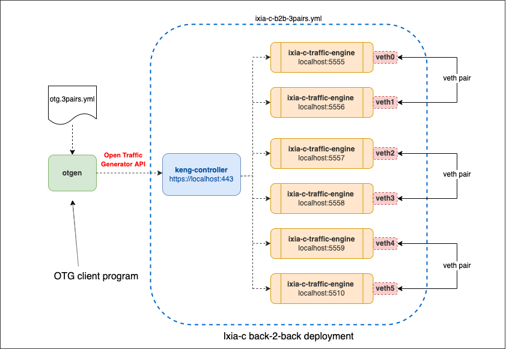

# Keysight Elastic Traffic Generator traffic engine back-to-back setup with Docker Compose

## Overview
This lab is an extension of Ixia-c back-to-back traffic engine setup. Free version of Ixia-c supports up to 4 traffic engine ports. If number of ports you need exceeds four, a commercial subscription to Ixia-c – Keysight Elastic Traffic Generator - should be used. In this setup, we're using an evaluation copy of Keysight Elastic Traffic Generator controller, which is set to expire by 9/30/2022. Read more about access to the evaluation copy in [KENG.md](/KENG.md).




## Preprequisites

* Linux host or VM with sudo permissions and Docker support
* [Docker](https://docs.docker.com/engine/install/)

## Install components

1. Install `docker-compose`

```Shell
sudo curl -L "https://github.com/docker/compose/releases/download/1.29.2/docker-compose-$(uname -s)-$(uname -m)" -o /usr/local/bin/docker-compose
sudo chmod +x /usr/local/bin/docker-compose
```

2. Install `otgen`

```Shell
curl -L "https://github.com/open-traffic-generator/otgen/releases/download/v0.2.0/otgen_0.2.0_$(uname -s)_$(uname -m).tar.gz" | tar xzv otgen
sudo mv otgen /usr/local/bin/otgen
sudo chmod +x /usr/local/bin/otgen
```

## Deploy lab

1. Create 3 veth pairs

```Shell
sudo ip link add name veth0 type veth peer name veth1
sudo ip link set dev veth0 up
sudo ip link set dev veth1 up
sudo sysctl net.ipv6.conf.veth0.disable_ipv6=1
sudo sysctl net.ipv6.conf.veth1.disable_ipv6=1

sudo ip link add name veth2 type veth peer name veth3
sudo ip link set dev veth2 up
sudo ip link set dev veth3 up
sudo sysctl net.ipv6.conf.veth2.disable_ipv6=1
sudo sysctl net.ipv6.conf.veth3.disable_ipv6=1

sudo ip link add name veth4 type veth peer name veth5
sudo ip link set dev veth4 up
sudo ip link set dev veth5 up
sudo sysctl net.ipv6.conf.veth4.disable_ipv6=1
sudo sysctl net.ipv6.conf.veth5.disable_ipv6=1
```

2. Launch the deployment and adjust MTUs on the veth pair

```Shell
sudo docker-compose -f keng-te-eval-b2b.yml up -d 
sudo ip link set veth0 mtu 9500
sudo ip link set veth1 mtu 9500
sudo ip link set veth2 mtu 9500
sudo ip link set veth3 mtu 9500
sudo ip link set veth4 mtu 9500
sudo ip link set veth5 mtu 9500
````

3. Make sure you have all three containers running:

```Shell
sudo docker ps
```

  The result should look like this
  
```Shell
CONTAINER ID   IMAGE                                                              COMMAND                  CREATED         STATUS         PORTS     NAMES
6f3b3f0f4104   ghcr.io/open-traffic-generator/ixia-c-traffic-engine:1.6.0.9       "./entrypoint.sh"        7 seconds ago   Up 5 seconds             b2b_traffic_engine_1_1
2815f742922a   ghcr.io/open-traffic-generator/ixia-c-traffic-engine:1.6.0.9       "./entrypoint.sh"        7 seconds ago   Up 6 seconds             b2b_traffic_engine_6_1
7bafb0bc3bbc   ghcr.io/open-traffic-generator/ixia-c-traffic-engine:1.6.0.9       "./entrypoint.sh"        7 seconds ago   Up 5 seconds             b2b_traffic_engine_3_1
e205740a0f0d   ghcr.io/open-traffic-generator/ixia-c-traffic-engine:1.6.0.9       "./entrypoint.sh"        7 seconds ago   Up 5 seconds             b2b_traffic_engine_4_1
539f386b5e7e   ghcr.io/open-traffic-generator/ixia-c-traffic-engine:1.6.0.9       "./entrypoint.sh"        7 seconds ago   Up 5 seconds             b2b_traffic_engine_5_1
2ec23b5623dc   ghcr.io/open-traffic-generator/ixia-c-traffic-engine:1.6.0.9       "./entrypoint.sh"        7 seconds ago   Up 5 seconds             b2b_traffic_engine_2_1
16cfd8d59224   ghcr.io/open-traffic-generator/keng-commercial-sep-30:0.0.1-3113   "./bin/controller --…"   7 seconds ago   Up 5 seconds             b2b_controller_1
```

## Run OTG traffic flows

1. Start with using `otgen` to request Ixia-c to run traffic flows defined in `otg.yml`. If successful, the result will come as OTG port metrics in JSON format

```Shell
cat otg.3pairs.yml | otgen run -k
````

2. You can now repeat this exercise, but transform output to a table

```Shell
cat otg.3pairs.yml | otgen run -k 2>/dev/null | otgen transform -m port | otgen display -m table
````

3. The same, but with flow metrics

```Shell
cat otg.3pairs.yml | otgen run -k -m flow 2>/dev/null | otgen transform -m flow | otgen display -m table
````

4. The same, but with byte instead of frame count (only receive stats are reported)

```Shell
cat otg.3pairs.yml | otgen run -k -m flow 2>/dev/null | otgen transform -m flow -c bytes | otgen display -m table
````

5. Now report packet per second rate, as a line chart (end with `Crtl-c`)

```Shell
cat otg.3pairs.yml | otgen run -k -m flow 2>/dev/null | otgen transform -m flow -c pps | otgen display -m chart
````

## Destroy the lab

To destroy the lab, including veth pair, use:

```Shell
docker-compose -f keng-te-eval-b2b.yml down
sudo ip link del name veth0 type veth peer name veth1
sudo ip link del name veth2 type veth peer name veth3
sudo ip link del name veth4 type veth peer name veth5
````
