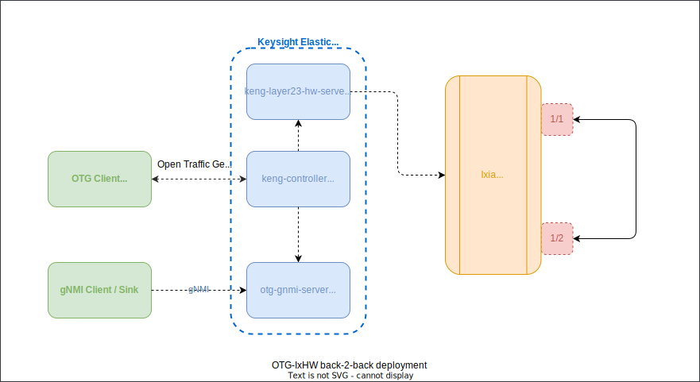

# OTG with Ixia L23 Hardware: back-to-back setup

## Overview
This example demonstrates how the OTG API can be used to control [Keysight/Ixia L23 Network Test Hardware](https://www.keysight.com/us/en/products/network-test/network-test-hardware.html). The same [Keysight Elastic Network Generator](https://www.keysight.com/us/en/products/network-test/protocol-load-test/keysight-elastic-network-generator.html) `keng-controller` that serves as the OTG API Endpoint for [Ixia-c software test ports](https://github.com/open-traffic-generator/otg-examples/tree/main/docker-compose/cpdp-b2b) can be used with the hardware test ports. Such deployment model requires to use `keng-layer23-hw-server` container image that provides an interface between the controller and the hardware test ports. See the diagram below that illustrates the components of such setup:



## Prerequisites

* Access to [Keysight Elastic Network Generator](https://www.keysight.com/us/en/products/network-test/protocol-load-test/keysight-elastic-network-generator.html) images. Read more in [KENG.md](../../KENG.md)

* Keysight Ixia Novus or AresOne [Network Test Hardware](https://www.keysight.com/us/en/products/network-test/network-test-hardware.html) with [IxOS](https://support.ixiacom.com/ixos-software-downloads-documentation) 9.20 Patch 4 or higher. **NOTE:** Currently, only Linux-based IxOS platforms are tested with KENG.

* Linux host or VM with sudo permissions and Docker support. Here is an example of deploying an Ubuntu VM `otg` using [multipass](https://multipass.run/):

    ```Shell
    multipass launch 22.04 -n otg -c4 -m8G -d32G
    multipass shell otg
    ```

* [Docker](https://docs.docker.com/engine/install/ubuntu/). Follow official instruction for

    - [Ubuntu](https://docs.docker.com/engine/install/ubuntu/)
    - [Debian](https://docs.docker.com/engine/install/debian/)
    - [CentOS](https://docs.docker.com/engine/install/centos/)

    After docker is installed, add current user to the docker group.

    ```Shell
    sudo usermod -aG docker $USER
    ```

* Python3 (version 3.9 or higher), PIP and VirtualEnv

    ```Shell
    sudo apt install python3 python3-pip python3.10-venv -y
    ```
* [Go](https://go.dev/dl/) version 1.19 or later

    ```Shell
    sudo snap install go --channel=1.19/stable --classic
    ```

* `git` and `envsubst` commands (typically installed by default)

    ```Shell
    sudo apt install git gettext-base -y
    ```

## Install components

    git clone --recursive https://github.com/open-traffic-generator/otg-examples.git
    cd otg-examples/hw/ixhw-b2b


## Deploy Keysight Elastic Network Generator

1. Launch the deployment with passing a hostname/IP address of the Keysight License Server as an environment variable `LICENSE_SERVERS`. Replace `license_server_name` with the actual hostname/IP address of your license server.

    ```Shell
    export LICENSE_SERVERS="license_server_name"
    docker compose up -d
    ```

2. To make sure all the containers are running, use

    ```Shell
    docker ps
    ```

    the list of containers should include:

    * `ixhw-b2b-controller-1`
    * `ixhw-b2b-layer23-hw-server-1`

3. Initialize environment variables with locations of Ixia L23 hardware ports. Replace `ixos_ip_address`, `slot_number_X`, `port_number_X` with values matching your equipment.

    ```Shell
    export OTG_LOCATION_P1="ixos_ip_address;slot_number_1;port_number_1"
    export OTG_LOCATION_P2="ixos_ip_address;slot_number_2;port_number_2"
    ```

    For example, if IxOS management IP is `10.10.10.10` and you need to use ports `14` and `15` in the slot number `2`:

    ```Shell
    export OTG_LOCATION_P1="10.10.10.10;2;14"
    export OTG_LOCATION_P2="10.10.10.10;2;15"
    ```

## Run OTG traffic flows with Python `snappi` library

1. Setup virtualenv for Python

    ```Shell
    python3 -m venv venv
    source venv/bin/activate
    pip install -r requirements.txt
    ```

2. Run flows via snappi script, reporting port metrics

    ```Shell
    ./snappi/otg-flows.py -m port
    ```

3. Run flows via snappi script, reporting port flow

    ```Shell
    ./snappi/otg-flows.py -m flow
    ```

## Cleanup

To stop the deployment, run:

```Shell
docker compose down
```

# OpenConfig Feature Profiles B2B test

## Deploy Keysight Elastic Network Generator

1. Launch the deployment

    ```Shell
    docker compose -p keng1 --file fp.compose.yml --file fp.compose.ports.yml up -d
    ```

2. To make sure all the containers are running, use

    ```Shell
    docker ps
    ```

    the list of containers should include:

    * `ixhw-b2b-ixia-c-controller-1`
    * `ixhw-b2b-ixia-c-ixhw-server-1`
    * `ixhw-b2b-ixia-c-gnmi-server-1`


3. Initialize environment variables with locations of Ixia L23 hardware ports. Replace `ixos_ip_address`, `slot_number_X`, `port_number_X` with values matching your equipment.

    ```Shell
    export OTG_LOCATION_P1="ixos_ip_address;slot_number_1;port_number_1"
    export OTG_LOCATION_P2="ixos_ip_address;slot_number_2;port_number_2"
    ```

    For example, if IxOS management IP is `10.10.10.10` and you need to use ports `14` and `15` in the slot number `2`:

    ```Shell
    export OTG_LOCATION_P1="10.10.10.10;2;14"
    export OTG_LOCATION_P2="10.10.10.10;2;15"
    ```

4. Create an [ONDATRA](https://github.com/openconfig/ondatra) binding file `otgb2b.binding` by using `otgb2b.template` as a template and substituting OTG port locations using the environmental variables initialized in the previous step.

    ```Shell
    cat otgb2b.template | envsubst > otgb2b.binding
    export OTGB2B_BINDING="$(pwd)/otgb2b.binding"
    ```

### Run FeatureProfiles OTG HW back-2-back test

1. Clone [FeatureProfiles fork](https://github.com/open-traffic-generator/featureprofiles/tree/static) from Open Traffic Generator org. The back-2-back test we're going to use is published under the `static` branch we need to clone:

    ```Shell
    git clone -b static --depth 1 https://github.com/open-traffic-generator/featureprofiles.git fp-static
    ```

2. Run FeatureProfiles OTG HW B2B test

    ```Shell
    cd fp-static/feature/experimental/otg_only
    go test -v otgb2b_test.go -testbed otgb2b.testbed -binding "${OTGB2B_BINDING}"
    cd ../../../..
    ```

### Multi-seat deployment

If you need to support multiple concurrent seats (simultaneous tests) on the same VM, it is possible to launch several parallel instances of Keysight Elastic Network Generator.

1. What you need for that is to choose a set of different TCP ports that `ixia-c-controller` and `ixia-c-gnmi-server` would be mapped to on the host. As an example, see the file [fp.compose.ports2.yml](fp.compose.ports2.yml). You would also need start the deployment using a non-default project name, so that the second set of containers would run over a dedicated network.

    ```Shell
    docker compose -p keng2 --file fp.compose.yml --file fp.compose.ports2.yml up -d
    ```

2. Now create a second ONDATRA binding file, for example `otgb2b.binding2`:

    ```Shell
    cp otgb2b.binding otgb2b.binding2
    # change TCP ports for both otg and gnmi targets
    # change port name strings to use different IxHW ports
    vi otgb2b.binding2
    export OTGB2B_BINDING="$(pwd)/otgb2b.binding2"
    ```

Now you're ready to run the two parallel tests via the same VM using two different binding files.

## Cleanup

To stop the deployment, run:

```Shell
docker compose -p keng1 --file fp.compose.yml down
docker compose -p keng2 --file fp.compose.yml down
```

## Diagnostics

To collect diagnostics logs from all the components of the lab, run:

```Shell
../../utils/collect-ixia-c-hw-logs.sh
```

It will create a `logs-DATE.tar.gz` file you can share with Keysight for troubleshooting.

> TIP. Use `make logs` if you have `make` on your system

## Notable changes

This example was updated to use built-in `docker compose` utility instead of standalone but outdated `docker-compose`. As far as we tested, both worked with this example at the time of the change on July 11, 2023. Moving forward, only compatibility with `docker compose` will be tested.