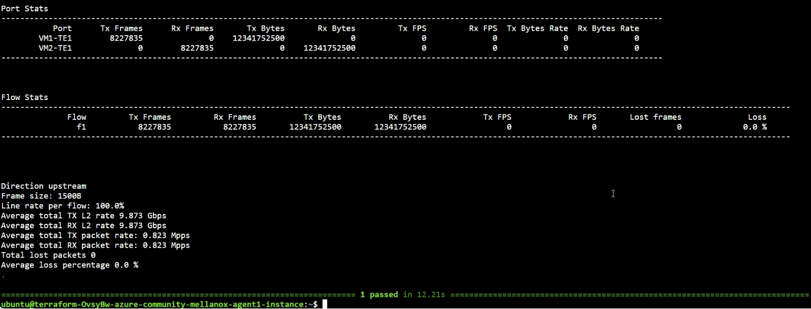
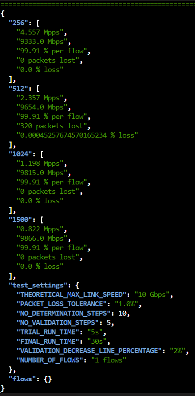

# Ixia-c traffic engine deployment on Azure with Mellanox DPDK

## Overview
This is a public cloud lab where [Ixia-c](https://github.com/open-traffic-generator/ixia-c) has two traffic ports connected within a single subnet of an Azure.
The environment is deployed using [Terraform](https://www.terraform.io/) and [Cloud-Init](https://cloud-init.io/) is used to configure the application and traffic engines.
Performance improvements are enabled through [DPDK](https://www.dpdk.org/) support.
Once the lab is up, a Python script is used to request Ixia-c to generate traffic and report statistics.

## Prerequisites
* This lab requires the commands below to be executed from within [Azure CloudShell](https://learn.microsoft.com/en-us/azure/cloud-shell/overview).
* The created VMs needs to have at least ConnectX4 or ConnectX5. Mellanox ConnectX3 is not longer supported.    
  Use the `lspci` command to check NIC type.   
E.g.
```
ubuntu@terraform-v8KJ8A-azure-community-mellanox-agent1-instance:~$ lspci
8ada:00:02.0 Ethernet controller: Mellanox Technologies MT27710 Family [ConnectX-4 Lx Virtual Function] (rev 80)
```

## Clone the repository

```
git clone --recursive https://github.com/open-traffic-generator/otg-examples.git
```

## Navigate to the lab subdirectory within the repository

```
cd otg-examples/public-cloud/azure/ixia-c-dpdk-azure-mellanox
```

## Deploy Ixia-c lab

1. Create Terraform deployment.

2. Wait approximately 6 minutes for infrastructure to be deployed.

3. Execute Python test case to generate traffic between Azure instances.

    ```
    make azure
    ```

4. Connect to Agent1 Azure VM .

    ```
    make connect
    ```


## Execute Traffic Test additional times as needed

1. Execute unidirectional test case to generate traffic between Azure instances.

    ```
    ubuntu@agent1$ make run
    ```

2. Execute bidirectional test case to generate traffic between Azure instances.

    ```
    ubuntu@agent1$ make run-bidirectional
    ```

3. Execute rfc2544 test case to generate traffic between Azure instances.

    ```
    ubuntu@agent1$ make run-rfc2544
    ```

## Results
1. Unidirectional TCP flow

2. Bidirectional TCP flow

1. RFC-2544 for the following frame sizes: 256B, 512B, 1024B and 1500B   


## Destroy the lab

1. Destroy the Terraform deployment

    ```
    ubuntu@agent1$ exit
    make clean
    ```
